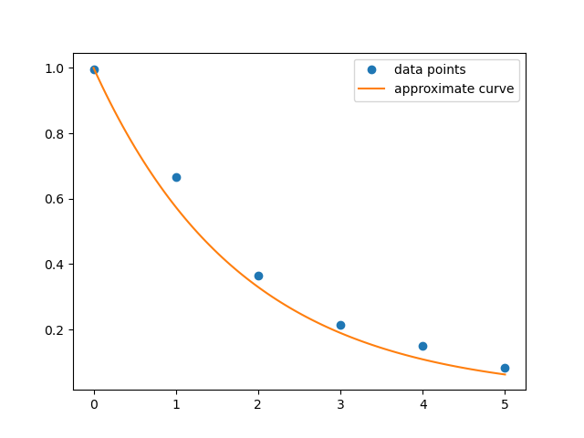

Linear algebra boasts a huge array of applications to the real world.  Below, we describe some examples of problems which can be solved using linear algebra.

## Least-squares fitting
In physics we often have to compare a **model** describing relationships between real-world data to actual data obtained from experiments.
For example, one model for nuclear decay says that the mass $$m$$ of a radioactive isotope present at time $$t$$ is given by

$$m(t) = m_02^{-t/\lambda}$$

where $$m_0$$ is the initial mass of the isotope and $$\lambda$$ is the half-life, ie. the time that it takes the mass to be reduced by half.  A lot of things can get in the way of the real-world measurements reflecting the model exactly, such as measurement error.  For example, in the laboratory we might observe the following measurements versus time

|time (days)| mass (kg)|
| --------- | -------- |
|$$t_0 = 0$$|$$m_0 = 0.9950$$|
|$$t_1 = 1$$|$$m_0 = 0.6651$$|
|$$t_2 = 2$$|$$m_0 = 0.3654$$|
|$$t_3 = 3$$|$$m_0 = 0.2150$$|
|$$t_4 = 4$$|$$m_0 = 0.1512$$|
|$$t_5 = 5$$|$$m_0 = 0.0821$$|

By plotting this data, we can see that it *looks* like it fits a generally exponentially decreasing pattern, with maybe a little bit of noise.

  

If we can make our model as accurate as possible, then we can use it to predict what the mass of the isotope will be in the future.  Thus we want to know the values of the constants $$m_0$$ and $$\lambda$$ so that the model most closely fits the data.  Formally, we want to find a **least squares fit** of the data to the model, ie. values of the parameters $$m_0$$ and $$\lambda$$ minimizing the root mean square error

$$E_{\text{rms}} = \left(\sum_j (m(t_j)-m_j)^2\right)^{1/2}.$$

## Digital image processing

Your supervisor in the Space Force has obtained the following photo of a suspect in a recent space robbery.  Unfortunately, the picture is covered in strange squiggles and logos.  Your job is to come up with a good guess of what the original image looked like.

  

Fortunately, we can accomplish the task via digital image processing.  In the computer, the image is made up of a bunch of tiny, solid-colored boxes called **pixels**.  Each pixel has a specific color value, and by solving a linear system of equations relating pixel values to their neighbors we can perform a process called **in-painting** to fill in a good approximation of what the photo looks like without the damaged component.

  

## Data analysis and machine learning

Your friend owns a house that they want to put on the market to sell and they need to figure out a fair asking price.  Several other houses in the neighborhood were sold recently, and the data for these houses is given by

|lot size (sq. ft)|living space (sq. ft)|bedrooms|baths|floors|price (USD)|
| --------------- | ------------------- | ------ | --- | ---- | --------- |
|5650|1180|3|1|1|221900|
|7242|2520|3|2|2|538000|
|9000| 770|2|1|1|180000|
|5000|1960|4|3|1|604000|
|8080|1680|3|2|1|510000|

Your friends house is a single-story with 1500 square feet of living space, a 6000 square ft total lot size, two bedrooms and two baths.  Your problem is to decide what value should we guess for him as a reasonable asking price.

To do so, we can again use linear algebra!  We use a process called **linear regression** to fit the above data set to a linear model for the price.  Then by inputting our friends data into our model, we can give a reasonable guess for the right asking price.

## Solving differential equations
Many physical systems are governed by differential equations, which relate a certain physical quantity to its derivatives.
For example, a differential equation describing the angle of a pendulum $$\theta$$ as a function of time $$t$$ in the presense of friction is

$$\frac{d^2\theta}{dt^2} + \beta\frac{d\theta}{dt} + \kappa^2\theta = 0.$$

The above equation relates the function $$\theta(t)$$ to its first and second derivatives, determining the function up to 
We can approximate solutions to differential equations like this one by using linear algebra on a computer.

